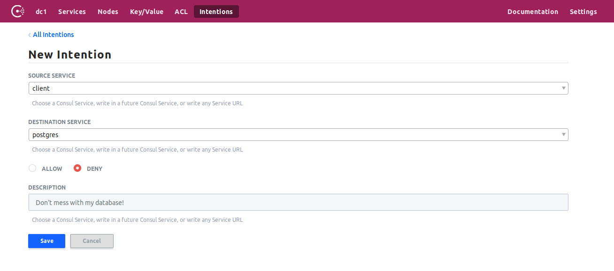
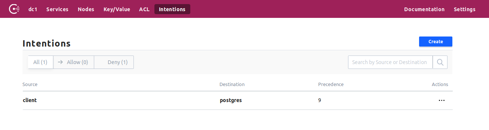

# Consul Connect Kickstarter

This is meant to be an initial kickstarter to understand and try out [Hashicorp Consul's](https://www.consul.io/) new capability called "[Connect](https://www.consul.io/docs/connect/index.html)", which is a service mesh baked directly into Consul, with support for [Nomad](https://www.nomadproject.io) and outside proxy connectors.

## Prerequisites

- Docker (>= 18.03.0-ce)
- docker-compose (>= 1.20.1)
- bash (for running the convenience script)

## Running the composed application setup

```
$ ./run compose
```

This will provision the following setup:

1. A Consul server, with its UI exposed on [localhost:8500/ui](http://localhost:8500). ACLs are disabled, the default datacenter `dc1` is used.
2. Two Consul agents, `db-agent` and `client-agent`, connected to the server via a `gossip` network, so they can form a cluster
3. A custom, unmanaged [connect proxy](https://www.consul.io/docs/connect/proxies.html), registering with the Consul cluster as a connection handler for the `postgres` service
4. A PostgreSQL database container, running the verbatim default setup (connections are accepted from anywhere, the user is `postgres`, no password), able to talk to `db-agent` and `db-proxy`
5. A `client-proxy` container, which runs a local proxy, able to forward connections to the PostgreSQL container using Consul Connect.

### Tearing it all down again

Just press `CTRL+C` on the output window. A trap will automatically reap all remaining processes and remove all networks, containers and volumes created by the setup.

## Outcome

The client (`client-proxy`) and the database (`db`) are physically incapable of connecting directly to one-another. It's impossible. But you can use Consul Connect in order for the client to utilize the fully secured connection tunnel between the proxies to talk to the database:

```
# Connect to the client-proxy container
$ docker exec -ti consulconnectkickstarter_client-proxy_1 /bin/sh
# Connect to the database using Consul Connect, via the client proxy listening on port 5432 on 127.0.0.1
$ psql -h 127.0.0.1 -U postgres
psql (10.4)
Type "help" for help.

postgres=#
```

You are now connected to your database, via Consul Connect, using mutual TLS for authentication and authorization, via the two client proxies. Congrats!

### Intentions

ACLs are disabled for this kickstarter, they would add an unnecessary layer of complexity for initially trying out the application. **This means the [intentions](https://www.consul.io/docs/connect/intentions.html) subsystem for managing connection access (i.e. the authorization layer) is open by default**. So don't be surprised your client is able to connect via Consul Connect although there's no explicit intention allowing you to do so.

Once you were to switch your ACL enforcement to `deny` by default this would be automatically applied to the default intention as well.

Your can try out the intention authorization layer by explicitly denying access to the client service [via the UI](http://localhost:8501/ui/dc1/intentions). Click on `Create`, select `client` as the `SOURCE SERVICE` and `postgres` as the `DESTINATION SERVICE` and `Deny`. Leave a `Description` if you want to and submit the form with `Save`:





Now you should no longer be able to connect to the database using the client:

```
$ psql -h 127.0.0.1 -U postgres
psql: server closed the connection unexpectedly
  This probably means the server terminated abnormally
  before or while processing the request.
```

And in the `client-proxy` logs you're going to notice:

```
client-proxy_1  |     2018/06/27 14:32:32 [ERR] failed to dial: remote error: tls: bad certificate
```

This is because an intention explicitly forbids the identity `client` from connecting to the service `postgres`, and thus the `client-proxy` will be unable to attain a valid certificate from the Consul cluster in order to connect to the streaming proxy of the database using mutual TLS.

## Caveats

- The basic proxy provided by Consul isn't very configurable for this scenario. Thus it only allows for it to be connected via `127.0.0.1`, i.e. you have to start the client proxy in the same environment the application that is supposed to use the proxy is started in. This will either be solved in the future by extending the proxy's ability to interpret configuration parameters, supporting other schedulers or by another proxy which is not embedded inside Consul.
- Running the proxy "natively" through Consul directly does not work in a "pure" container environment (yet). It will be in the near-term future, but right now you have to run each service proxy as an unmanaged proxy outside of Consul. Luckily, the embedded Consul Connect proxy shipped with the Consul binary is flexible enough to register itself within Consul and route traffic based on what the cluster tells it to do.
- There are no Terraform definitions for intentions yet, but I might add those later. Right now you'll either have to whip them up yourself, use the API directly or go through the UI.
